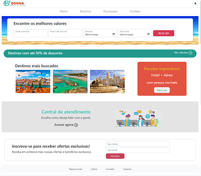

# Agencia-de-Viagens
**Projeto Prático Individual - Formação Full Stack Recode Pro 2022.**
**Donna Agência de Viagens**

## Tecnologias usadas
### Front-end
- HTML5
- CSS3
- JavaScript
- Bootstrap

### Back-end
- Java
- Spring Boot

### Database 
- MySQL

## Layout

## Como executar
1- Crie um banco de dados MySQL:
   - create database agenciadonna;
   - use agenciadonna;
   
2- Clone o repositorio
   - Utilizei o Spring-tool-4;
   - Clique no botão Run As e escolha a opção Spring Boot App;
   - Abra o navegador e digite: http://localhost:8080

Pronto!

